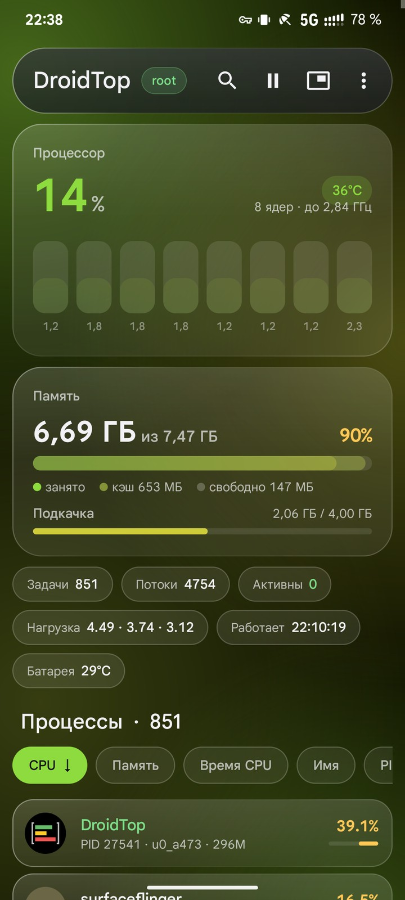
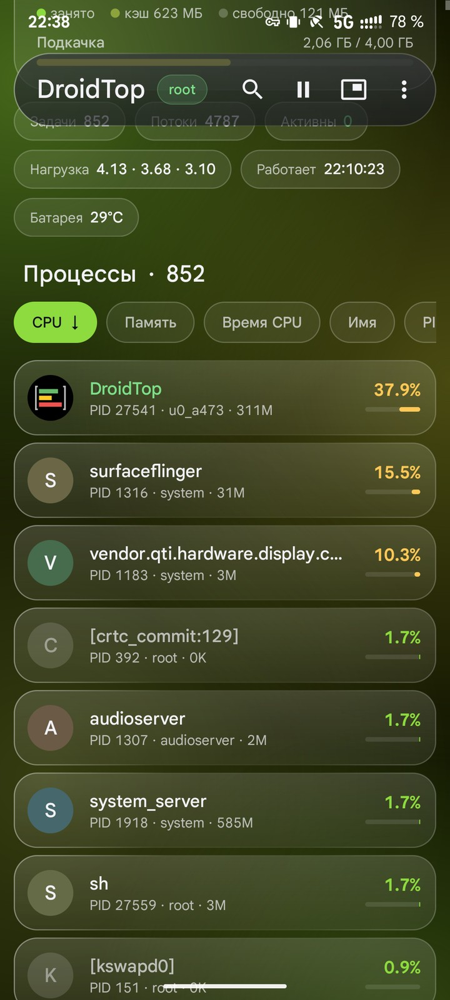
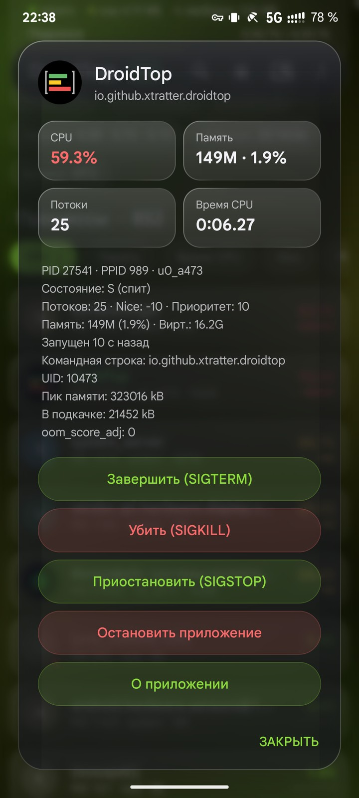
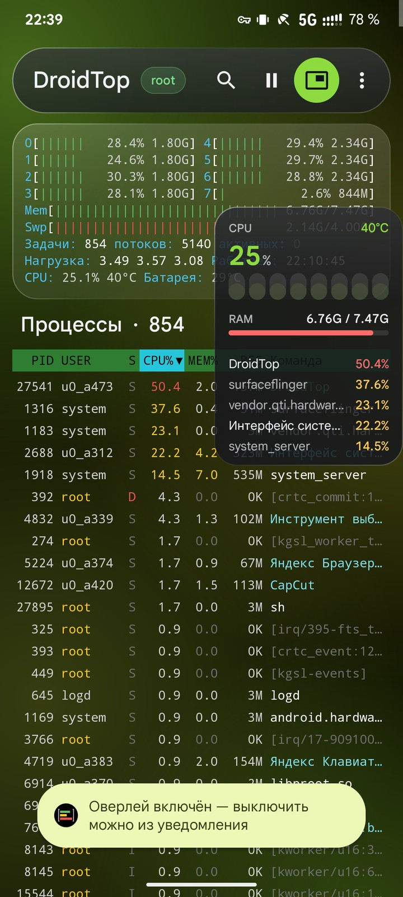
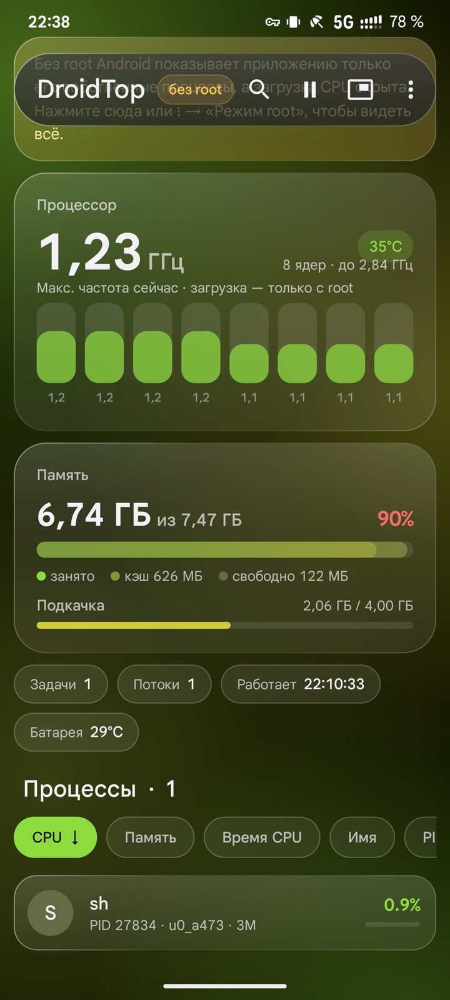

# 📊 DroidTop

**Русский** · [English](README.md)

Монитор процессов и ресурсов для Android по мотивам **htop**: какие процессы работают,
сколько они едят процессора и памяти, как загружено каждое ядро — и всё это ещё и в
плавающем окошке поверх других приложений.

## Как это выглядит

| Главный экран | Список процессов | Процесс |
|:---:|:---:|:---:|
|  |  |  |
| **Таблица htop и оверлей** | **Без root** | |
|  |  | |

## Скачать

Готовые APK — в разделе [Releases](https://github.com/Xtratter/droidtop/releases). Нужен Android 8.0 или новее.

## Возможности

- **Дизайн Material 3 с «жидким стеклом»** — полупрозрачные карточки поверх мягкого цветного фона,
  цвета подстраиваются под обои (Android 12+), плавные анимации. Любителям классики — режим таблицы htop (⋮ → Настройки)
- **Темы**: стандартная, как в системе, AMOLED (чёрная), светлая, графит и классический htop (⋮ → Настройки → Тема); нажатие на название DroidTop включает следующую тему, удержание возвращает стандартную
- **Мягкие размытые края, вибрация и справка по удержанию** (общий набор [android-ui-kit](https://github.com/Xtratter/android-ui-kit)); сила вибрации — в настройках

- **Зум в таблице htop** — разведите или сведите два пальца, чтобы увеличить или уменьшить шрифт таблицы и «метров»
  (размер запоминается, его же можно выбрать в настройках)
- **Метры как в htop** — загрузка и частота каждого ядра, память, подкачка (zram), задачи,
  средняя нагрузка, время работы, температура CPU и батареи
- **Список процессов** — PID, USER, S, CPU%, MEM%, RES, THR, TIME+; нажатие на заголовок колонки сортирует
  (повторное — меняет направление). На узком экране лишние колонки прячутся, в альбомной ориентации появляются
- **Дерево процессов** (чип «Дерево», как F5 в htop) — кто кого запустил: `init` → `zygote64` → приложения → их
  дочерние процессы. Нажатие на значок сворачивает ветку, в карточке процесса есть ссылки на родителя и всех потомков
- **Видеочип (GPU)** — загрузка, частота, модель и температура Adreno или Mali: карточка с графиком, строка в таблице htop и в оверлее
- **Графики истории** CPU, памяти, GPU и мощности батареи за последние 20 минут, а в карточке процесса — его CPU и память.
  Проведите пальцем по графику — увидите значение в любой момент, разведите или сведите два пальца —
  покажется отрезок от 40 секунд до 20 минут
- **Батарея** — мощность в ваттах, ток, напряжение, температура и прогноз «осталось ≈ …» / «до полного …» (без root)
- **Названия приложений** вместо `com.example.app`, поиск по имени, PID или пользователю
- **Нажатие на процесс** — подробности (командная строка, пик памяти, подкачка, `oom_score_adj`) и действия:
  SIGTERM, SIGKILL, SIGSTOP/SIGCONT, остановить приложение, открыть «О приложении»
- **Потоки и открытые файлы** процесса (кнопки в его карточке): загрузка CPU каждого потока вживую, его состояние и ядро;
  открытые файлы, устройства, каналы и сокеты — с адресами и состоянием TCP/UDP или путём Unix-сокета
- **Об устройстве** (⋮ → «Об устройстве») в духе AIDA64: модель, Android и ядро, чипсет с кластерами ядер
  (названия Cortex и диапазоны частот), память, накопитель, экран, видеочип с OpenGL ES / Vulkan, состояние и циклы батареи,
  камеры, датчики и все датчики температуры. Нажатие на строку копирует её, долгое нажатие на раздел — раздел, есть «Копировать всё»
- **Копирование в буфер обмена**: сводка текущего состояния (⋮ → «Копировать сводку»: CPU, ядра, память, GPU, батарея, топ-10 процессов),
  сведения о процессе, списки потоков и открытых файлов
- **Запись статистики приложения в файл**: «Записывать статистику в файл» в карточке процесса пишет CSV в `Download/DroidTop/`
  на каждом замере — CPU и память всех процессов приложения, а также общий CPU, температура, память, GPU и батарея — пока запись
  не остановят в уведомлении или меню ⋮. После остановки уведомление показывает средние и максимумы и открывает файл
- **Плавающий оверлей** (⋮ → «Плавающий оверлей»): CPU, столбики ядер, память, GPU и топ процессов.
  Перетаскивается пальцем, нажатие открывает DroidTop, закрыть — из уведомления.
  В настройках можно выбрать, что на нём показывать, размер и ширину, сколько процессов в топе и сортировать
  их по CPU или по памяти, непрозрачность фона, а также закрепить его на месте

## Режимы доступа: обычный, Shizuku, root

| | Обычный | [Shizuku](https://shizuku.rikka.app/) | Root |
|---|:---:|:---:|:---:|
| Память, подкачка, частоты ядер, температуры, батарея | ✅ | ✅ | ✅ |
| Загрузка CPU (общая и по ядрам) | ❌ | ✅ | ✅ |
| Загрузка и частота GPU (Adreno, Mali) | обычно ❌ | зависит от прошивки | ✅ |
| Список процессов и дерево | только свои | все | все |
| Остановка приложений (force stop) | ❌ | ✅ | ✅ |
| Завершение любых процессов (kill) | ❌ | только shell | ✅ |
| Потоки процесса | только свои | все | все |
| Открытые файлы и сокеты | только свои | только shell | все |

Так решил Android: с версии 7 приложение видит только свои процессы, с версии 8 скрыт `/proc/stat`.
Режим выбирается нажатием на чип рядом с названием или в меню ⋮ → «Режим доступа».

- **Shizuku — без root.** Бесплатное приложение [Shizuku](https://shizuku.rikka.app/download/) даёт права ADB:
  установите его, запустите службу через «Беспроводную отладку» (Android 11+) и выберите режим Shizuku —
  DroidTop спросит разрешение. После перезагрузки телефона службу Shizuku нужно запустить снова.
- **Root** — KernelSU, Magisk или APatch: разрешите DroidTop в менеджере root.

> [!WARNING]
> Завершение системных процессов (`system_server`, `surfaceflinger` и т. п.) может подвесить или перезагрузить телефон.
> DroidTop спрашивает подтверждение, но будьте внимательны.

## Как это устроено

Никаких нативных библиотек: приложение держит открытую оболочку (`sh` или `su`) и раз в
несколько секунд одной командой читает `/proc/stat`, `/proc/meminfo`, `/proc/[pid]/stat`,
частоты из `/sys/devices/system/cpu`, температуры из `/sys/class/thermal` и данные видеочипа
из `/sys/class/kgsl` или `/sys/kernel/gpu` — это один вызов `grep`, то есть один короткий процесс
за обновление. Полные имена процессов берутся из `ps` только для новых PID. Когда открыт только
оверлей, имена ищутся лишь для самых активных процессов, а при выключенном экране опрос
полностью останавливается.

```
app/src/main/java/io/github/xtratter/droidtop/
├── Shell.kt          ← постоянная оболочка: sh, sh через Shizuku или su
├── ProcParser.kt     ← скрипт опроса и разбор /proc
├── Sampler.kt        ← фоновый поток опроса, общий для экрана и оверлея
├── Model.kt          ← Snapshot, ProcInfo, сортировки
├── Tree.kt           ← дерево процессов (родители и потомки)
├── History.kt, Chart.kt, ChartView.kt       ← история замеров и графики
├── Battery.kt, BatteryCard.kt               ← ток, мощность и прогноз батареи
├── Gpu.kt, GpuCard.kt                       ← загрузка и частота видеочипа из /sys
├── MainActivity.kt   ← экран, меню, поиск
├── Ui.kt             ← цвета Material You, «стекло», фон, анимации
├── CpuCard.kt, MemCard.kt, ChipsView.kt     ← карточки процессора, памяти и сводки
├── ProcItemView.kt, SortBar.kt, AppIcons.kt ← список процессов карточками
├── MetersView.kt     ← полоски ядер и памяти (режим таблицы htop)
├── Table.kt, HeaderView.kt, ProcRowView.kt  ← таблица процессов
├── ProcessDialog.kt  ← подробности и действия с процессом
├── DeviceInfo.kt, DeviceDialog.kt           ← сведения об устройстве
├── Record.kt, RecordService.kt              ← запись статистики приложения в CSV
├── Summary.kt, Clip.kt                      ← текстовая сводка, буфер обмена
├── InspectDialog.kt, Inspect.kt             ← потоки и открытые файлы процесса
├── SettingsDialog.kt, Prefs.kt              ← настройки
└── OverlayService.kt, OverlayView.kt        ← плавающий оверлей
```

## Сборка

```sh
./gradlew assembleDebug        # → app/build/outputs/apk/debug/app-debug.apk
./gradlew assembleRelease      # → release-сборка (R8), подписать через apksigner
./gradlew testDebugUnitTest    # тесты разбора /proc
```

Требуется JDK 17 и Android SDK (platform 35, build-tools 35.0.0). Единственная библиотека — [Shizuku API](https://github.com/RikkaApps/Shizuku-API) (Apache-2.0).
Подробная инструкция по сборке на телефоне — в репозитории
[cat-hunt](https://github.com/Xtratter/cat-hunt/blob/main/docs/GUIDE.md).

## Лицензия

[GPL-3.0-or-later](LICENSE)
